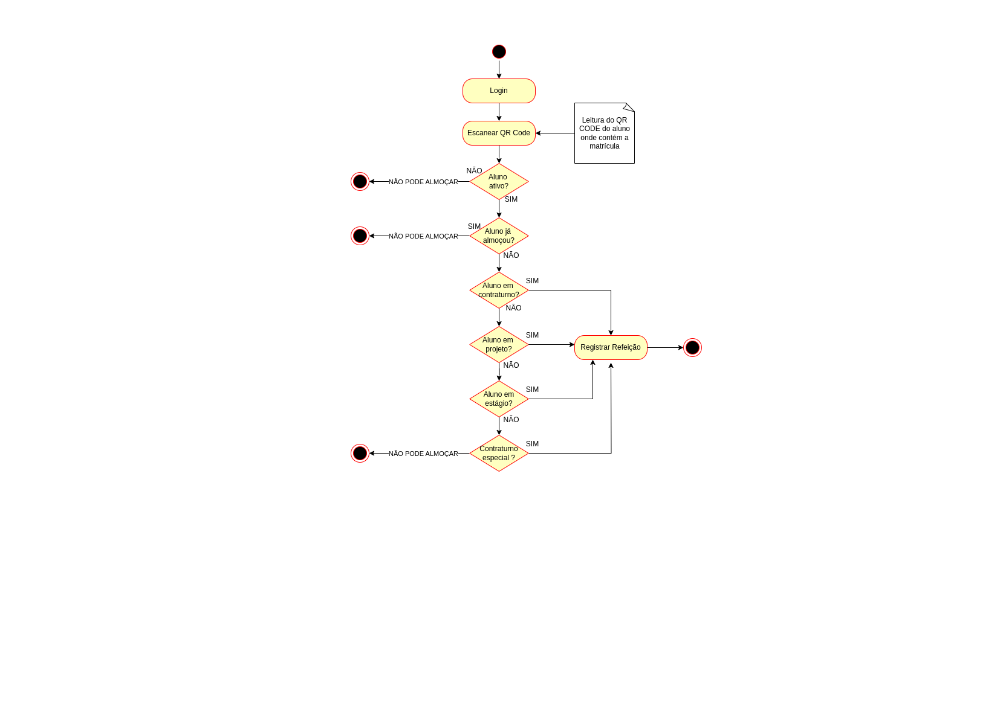
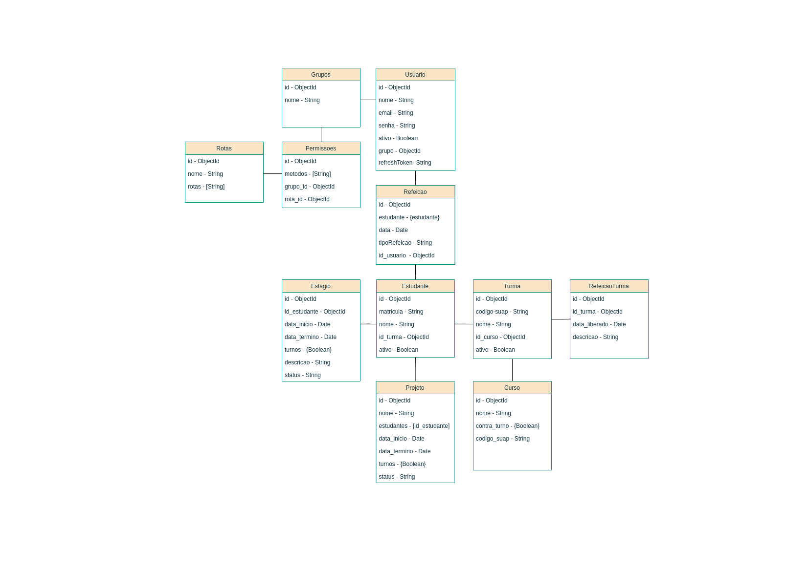

# 🍽️ Refeições - IFRO Campus Vilhena

Sistema de gerenciamento de refeições (almoços) dos estudantes do Instituto Federal de Rondônia – Campus Vilhena, com funcionalidades específicas para o controle de refeições por curso, turma, estágio e projetos.

---

## 📱 Sobre o Projeto

Este aplicativo Android tem como objetivo principal facilitar a gestão dos almoços oferecidos aos alunos, permitindo que a equipe do CAED e os funcionários da cantina possam controlar, registrar e validar as refeições com base em critérios como contra-turno, estágio, participação em projetos, entre outros.

---

## ✅ Funcionalidades

- Login de usuários (CAED ou Funcionários da Cantina)
- Cadastro e validação de refeições
- Gerenciamento de:
  - Usuários (com níveis de permissão)
  - Cursos
  - Turmas
  - Estágios
  - Projetos
- Relatórios de refeições servidas
- Controle de refeições atípicas

---

## 🔐 Permissões de Acesso

| Perfil                  | Permissões                                                                         |
|-------------------------|------------------------------------------------------------------------------------|
| **CAED**                | Acesso total: cursos, turmas, refeições, usuários, projetos, relatórios e estágios |
| **Funcionário Cantina** | Cadastrar refeições e gerar relatórios                                             |

---

## ⚙️ Tecnologias Utilizadas

- **Linguagem**: Kotlin 
- **Backend/API**: Node.js
- **Banco de Dados**: MongoDB
- **Controle de Versão**: GitLab

---

## Requisitos Funcionais

### Login

- **RF01**: O sistema deve permitir o login de usuários, que podem ser:
  - Funcionários da cantina
  - Membros da equipe CAED (Coordenação de Assistência ao Educando)

### Gerenciamento de Estudantes

- **RF02**: O sistema deve integrar-se com o SUAP para obter, diariamente, informações atualizadas dos estudantes.

### Gerenciamento de Refeições

- **RF03**: O sistema deve permitir que usuários com perfil CAED realizem o cadastro de refeições para estudantes.
- **RF03.1**: O sistema deve verificar se o estudante está autorizado a almoçar, com base em regras definidas.
- **RF03.2**: O sistema deve validar o motivo do almoço do estudante, podendo ser:
  - Contra-turno do curso
  - Contra-turno especial da turma
  - Participação em projeto institucional
  - Realização de estágio
- **RF04**: O sistema deve permitir o cadastro de refeições por turma específica, mesmo em dias fora do contra-turno oficial.

### Gerenciamento de Usuários

- **RF05**: O sistema deve possuir dois grupos de permissão:
  - CAED (Administrador): acesso total às rotas de turma, curso, estágio, projeto, refeição, refeição atípica, usuários e relatórios.
  - Funcionários da Cantina (Usuário): permissão para cadastrar refeições e gerar relatórios.
- **RF06**: O sistema deve permitir a inativação de usuários.
- **RF07**: O sistema deve permitir a edição das informações de usuários.

### Gerenciamento de Cursos

- **RF08**: O sistema deve permitir o cadastro de novos cursos.
- **RF09**: O sistema deve permitir a alteração do contra-turno associado a um curso.
- **RF10**: O sistema deve permitir a inativação de cursos.

### Gerenciamento de Projetos

- **RF11**: O sistema deve permitir o cadastro de projetos institucionais.
- **RF12**: O sistema deve permitir a alteração dos dias em que os estudantes do projeto irão almoçar.
- **RF13**: O sistema deve permitir a inativação de projetos.

### Gerenciamento de Turmas

- **RF14**: O sistema deve permitir o cadastro de turmas.
- **RF15**: O sistema deve permitir a alteração do contra-turno das turmas.
- **RF16**: O sistema deve permitir a inativação de turmas.

### Gerenciamento de Estágios

- **RF17**: O sistema deve permitir o cadastro de estágios.
- **RF18**: O sistema deve permitir a definição ou alteração dos dias em que os estagiários irão almoçar.
- **RF19**: O sistema deve permitir a inativação de estágios.

---

## Diagramas
- Diagrama de atividade


---
- Modelagem banco de dados


---

## 🚀 Como Executar a API

Siga os passos abaixo para clonar e preparar o ambiente:

```bash
# 1. Clone este repositório
git clone ssh://git@gitlab.fslab.dev:4241/f-brica-de-software-iv-2025-1/refeicoes.git

# 2. Acesse a pasta do projeto
cd refeicoes

# 3. Acesse o diretório do back-end
cd refeicoes/back-end/

# 4. Copie o arquivo de variáveis de ambiente
cp .env.example .env

# 5. Instale as dependências do projeto
npm install

# 6. Comando para start da API
npm run dev

